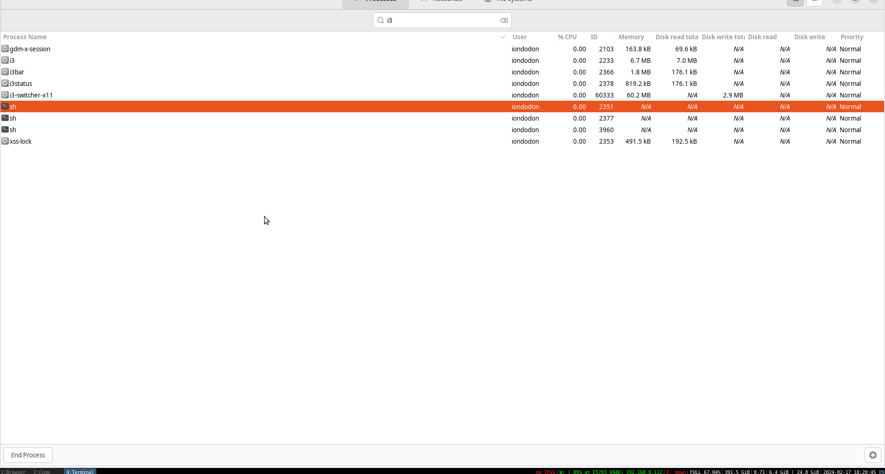

# i3wm Alt+Tab Workspace Switcher

The i3wm Alt+Tab Workspace Switcher is a tool designed to bring the familiar Alt+Tab window switching functionality to the i3 window manager environment. It aims to enhance productivity by enabling users to switch between workspaces efficiently and intuitively, mimicking the window switching feature found in traditional desktop environments like Windows.

<p align="center">
  
</p>

## Installation

Simply download the latest `.deb` package for debian based distributions or `.pkg.tar.zst` package for arch distributions, from the [releases section](https://github.com/iondodon/i3-switcher-x11/releases) of our GitHub repository.

For debian based distributions:

```bash
sudo dpkg -i path/to/downloaded/package-file.deb
```

For Arch distributions:

```bash
sudo pacman -U path/to/downloaded/package-file.pkg.tar.zst
```

Test if the application is running with `$ i3-switcher-x11` and then press `Alt+Tab`.

After installing, add the following two lines in the `~/.config/i3/config` file.
The first line will make the i3switcherX1 be a floating window.
The second line will start the i3switcherx11 when i3wm starts.

```bash
for_window [title="i3switcherX11"] floating enable
exec --no-startup-id i3-switcher-x11
```

## Styling

After first run there will be a `.i3-switcher-style.css` file in the user home directory. You can use this CSS to customize the look of the switcher.

## License

This project is licensed under the MIT License. For more information, please refer to the LICENSE file included in the repository.
